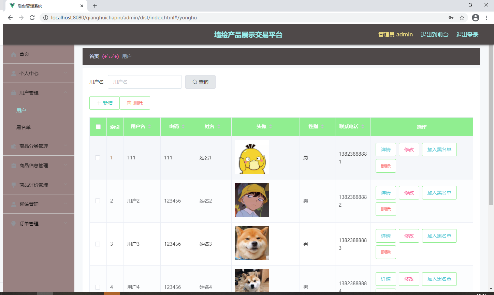

**项目简介：**  
本项目基于主流的前后端分离架构，采用 **SpringBoot + Vue 技术栈**，配套 **MySQL 数据库**，适用于毕业设计与课题实训开发。  
本人已整理了超 **4000 多套毕业设计源码+论文+开题报告+PPT...**，涵盖 **Java、SpringBoot、Vue、SSM、uni-app 小程序、PHP、Android** 等方向，支持功能修改定制与论文服务。  
**团队提供以下服务：**  
- 项目代码修改与调试  
- 数据库配置与远程协助  
- 论文定制与修改  
**获取更多的4000多套源码或SQL文件请联系：**  
- QQ：3906443360 微信：BesheHelp

## springboot037基于SpringBoot的墙绘产品展示交易平台的设计与实现

**项目简介：**  
本项目基于主流的前后端分离架构，采用 **SpringBoot + Vue 技术栈**，配套 **MySQL 数据库**，适用于毕业设计与课题实训开发。  
本人已整理了超 **4000 多套毕业设计源码+论文+开题报告+PPT...**，涵盖 **Java、SpringBoot、Vue、SSM、uni-app 小程序、PHP、Android** 等方向，支持功能修改定制与论文服务。  
**团队提供以下服务：**  
- 项目代码修改与调试  
- 数据库配置与远程协助  
- 论文定制与修改  
**获取更多的4000多套源码或SQL文件请联系：**  
- QQ：3906443360 微信：BesheHelp**

# 系统实现与系统测试

# 墙绘产品展示交易平台的设计方案比如功能框架的设计，比如数据库的设计的好坏也就决定了该系统在开发层面是否高效，以及在系统维护层面是否容易维护和升级，因为在系统实现阶段是需要考虑用户的所有需求，要是在设计阶段没有经过全方位考虑，那么系统实现的部分也就无从下手，所以系统设计部分也是至关重要的一个环节，只有根据用户需求进行细致全面的考虑，才有希望开发出功能健全稳定的程序软件。

4.1 系统概要设计

本次拟开发的系统为了节约开发成本，也为了后期在维护和升级上的便利性，打算通过浏览器来实现系统功能界面的展示，让程序软件的主要事务集中在后台的服务器端处理，前端部分只用处理少量的事务逻辑。下面使用一张图（如图4.1所示）来说明程序的工作原理。

图4.1 程序工作的原理图

4.2 系统功能结构设计

在分析并得出使用者对程序的功能要求时，就可以进行程序设计了。如图4.2展示的就是管理员功能结构图。

图4.2 系统功能结构图

4.3 数据库设计

程序功能操作不管是添加，修改，还是删除等功能产生的数据都是经由数据库进行数据保存和更新的，所以一个数据库设计的好坏也是程序是否好坏的判定标准，因为程序的成功，有一半的功劳都是靠数据库的优秀设计。数据库一旦设计得良好是可以减轻开发人员的开发负担的。

4.3.1 数据库E-R图设计

这个部分的设计需要使用到E-R图绘制工具，常用的工具就是Visio工具来绘制E-R模型图，这款工具不仅可以快速创建需要的E-R模型图，而且该工具提供的操作界面很简单，可以短时间内修改绘图界面的图形或者是文字的属性。在绘制E-R模型图时，要分清楚各个图形代表的含义，以免绘制出错，E-R模型图由长方形（实体），椭圆形（属性），菱形（关系）这三部分图形符号组成，绘制期间要区分开来，用准确的图形符号代表相应的数据元素。

各个实体之间的联系用下图的E-R图表示。绘制的系统E-R图见图4.8。

图4.8 系统E-R图

4.3.2 数据库表结构设计

数据库系统一旦选定之后，需要根据程序要求在数据库中建立数据库文件，并在已经完成创建的数据库文件里面，为程序运行中产生的数据建立对应的数据表格，数据表结构设计就是对创建的数据表格进行字段设计，字段长度设计，字段类型设计等，当数据表格合理设计完成之后，才能正常存储相关程序运行产生的数据信息。

表4.1地址表

表4.2购物车表

表4.3客服聊天表

表4.4商品信息评论表

表4.5商品资讯表

表4.6订单表

表4.7商品分类表

表4.8商品评价表

表4.9商品信息表

表4.10心愿单表

表4.11用户表

表4.12用户表

5 系统实现

系统实现部分就是将系统分析，系统设计部分的内容通过编码进行功能实现，以一个实际应用系统的形式展示系统分析与系统设计的结果。前面提到的系统分析，系统设计最主要还是进行功能，系统操作逻辑的设计，也包括了存储数据的数据库方面的设计等内容，系统实现就是一个最终的实施阶段，将前面的设计成果进行物理转化，最终出具可以运用于实际的软件系统。

5.1用户信息管理

如图5.1显示的就是用户信息管理页面，此页面提供给管理员的功能有：用户信息的查询管理，可以删除用户信息、修改用户信息、新增用户、将用户加入黑名单或取消信息，

还进行了对用户名称的模糊查询的条件

图5.1 用户信息管理页面

5.2 商品信息管理

如图5.2显示的就是商品信息管理页面，此页面提供给管理员的功能有：查看已发布的商品信息数据，修改商品信息，商品信息作废，即可删除。

图5.2 商品信息管理页面

5.3商品分类管理

如图5.3显示的就是商品分类管理页面，此页面提供给管理员的功能有：根据商品分类进行条件查询，还可以对商品分类进行新增、修改、查询操作等等。

图5.3 商品分类管理页面

5.1订单管理管理

如图5.4显示的就是订单管理管理页面，此页面提供给管理员的功能有：根据订单管理进行新增、修改、查询操作等等。

图5.4 订单管理管理页面

